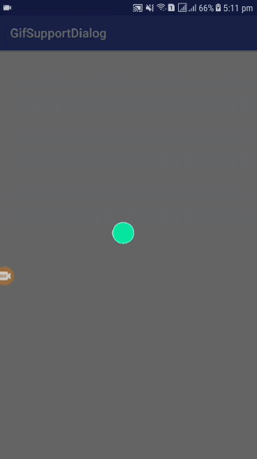

# Gif Loading Dialog
A utility library to facilitate developers to show the loading dialog with gif images support.
It is a singleton class to show the dialog where ever you want. Here is the screeshot 

    

# Add as dependency

Add following into your main project gradle file

    allprojects {
        repositories {
            maven { url 'https://jitpack.io' }
        }
    }

And now add dependency for library in your app gradle file

    dependencies {
        implementation 'com.github.Awais9:gifloadingdialog:v1.1'
	}

# How to use?

I use glide library for loading the gif images. It works for both static and gif images.

In your activity/fragment just make instance of it's dialog and use according to your need.

    /*create the instance for loading dialog which is singleton*/
    val loadingDialog = LoadingDialog.getInstance(this)

    /*show the dialog where you want*/
    loadingDialog.showDialog()

    /*hide the dialog when it is not needed*/
    loadingDialog.hideDialog()

    /*you can change your local gif image*/
    loadingDialog.currentDrawable = R.drawable.test

    /*you can change image by string url (link)*/
    loadingDialog.gifURL = "https://media.giphy.com/media/BYyLhBtSVgl2w/giphy.gif"

LoadingDialog is singleton class for custom dialog.
It have flexibilities to set your own static gif or image from local drawable or from remote link as showing above. 

Please feel free to use and contribute the library.
